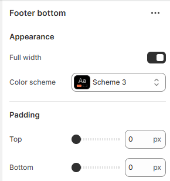

---
metaLinks:
  alternates:
    - https://app.gitbook.com/s/hbuQuZovtBBsMP54qBxh/footer-group/footer-bottom
---

# Footer Bottom

<figure><figcaption></figcaption></figure>

|                |                                                                              |
| -------------- | ---------------------------------------------------------------------------- |
| **Appearance** |                                                                              |
| Full width     | Enable for full-width view. (Controls the container width)                   |
| Color scheme   | Select any color scheme defined in the theme settings > Colors > Schemes.    |
| Padding        | Adjust the vertical padding of the section to control spacing. (Top, Bottom) |
