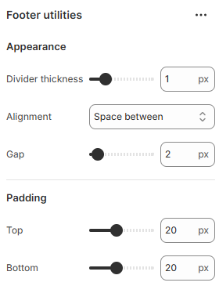

---
metaLinks:
  alternates:
    - >-
      https://app.gitbook.com/s/hbuQuZovtBBsMP54qBxh/footer-group/footer-bottom/footer-utilities
---

# Footer Utilities

<figure><figcaption></figcaption></figure>

|                   |                                                                              |
| ----------------- | ---------------------------------------------------------------------------- |
| **Appearance**    |                                                                              |
| Divider thickness | Adjust the divider thickness.                                                |
| Alignment         | Select the text alignment.                                                   |
| Gap               | Adjust the gap between the contents.                                         |
| Padding           | Adjust the vertical padding of the section to control spacing. (Top, Bottom) |
