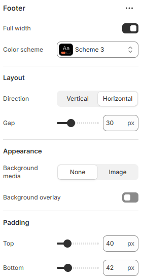

---
metaLinks:
  alternates:
    - https://app.gitbook.com/s/hbuQuZovtBBsMP54qBxh/footer-group/footer
---

# Footer

<figure><figcaption></figcaption></figure>

|                    |                                                                                                                                 |
| ------------------ | ------------------------------------------------------------------------------------------------------------------------------- |
| Full width         | Enable for full width view. (Controls the container width)                                                                      |
| Color scheme       | Select any color scheme defined in the theme settings > Colors > Schemes.                                                       |
| **Layout**         |                                                                                                                                 |
| Direction          | 
Choose the content arrangement direction.
 (Horizontal, Vertical)
                                                     |
| Gap                | Adjust spacing between footer elements within the group.                                                                        |
| **Appearance**     |                                                                                                                                 |
| Background media   | 
Select the type for the background group.
 (None, Image)
 If the background media is image then upload the image. 
 |
| Background overlay | Enable background overlay for the group.                                                                                        |
| Padding            | Adjust the vertical padding of the section to control spacing. (Top, Bottom)                                                    |
