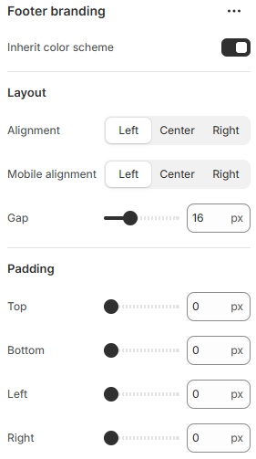

---
metaLinks:
  alternates:
    - >-
      https://app.gitbook.com/s/hbuQuZovtBBsMP54qBxh/footer-group/footer/footer-branding
---

# Footer branding

<figure><figcaption></figcaption></figure>

|                      |                                                                         |
| -------------------- | ----------------------------------------------------------------------- |
| Inherit color scheme | Inherit the color scheme from the global theme settings.                |
| **Layout**           |                                                                         |
| Alignment            | Choose the alignment of the text. (Left, Center, Right)                 |
| Mobile alignment     | Choose the alignment of the text on mobile view. (Left, Center, Right)  |
| Gap                  | Adjust spacing between content within the block.                        |
| Padding              | Adjust the padding range around the content. (Top, Bottom, Left, Right) |
