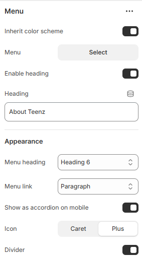
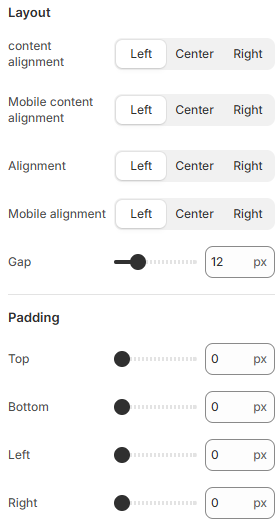

---
metaLinks:
  alternates:
    - >-
      https://app.gitbook.com/s/hbuQuZovtBBsMP54qBxh/footer-group/footer/footer-branding/menu
---

# Menu

<figure><figcaption></figcaption></figure> <figure><figcaption></figcaption></figure>

|                             |                                                                                                                                |
| --------------------------- | ------------------------------------------------------------------------------------------------------------------------------ |
| Inherit color scheme        | Inherit the color scheme from the global theme settings.                                                                       |
| Menu                        | Choose the footer menu to appear in the footer. Manage menus under Online Store > Content > Menu.                              |
| Enable heading              | Enable to view the heading text.                                                                                               |
| Heading                     | Add the heading text.                                                                                                          |
| **Appearance**              |                                                                                                                                |
| Menu heading                | Select the option from the typography. According to the selected option you will be adjusted to the font family and font size. |
| Menu link                   | Select the option from the typography. According to the selected option you will be adjusted to the font family and font size. |
| Show as accordion on mobile | 
Change the menu style to an accordion on
 mobile.
                                                                    |
| Icon Divider                | Select the icon for the mobile accordion                                                                                       |
| **Layout**                  |                                                                                                                                |
| Content alignment           | Choose the alignment of the block on the desktop. (Left, Center, Right)                                                        |
| Mobile content alignment    | Choose the alignment of the block on the mobile. (Left, Center, Right)                                                         |
| Alignment                   | Choose the alignment of the text on the desktop. (Left, Center, Right)                                                         |
| Mobile alignment            | Choose the alignment of the text on the mobile. (Left, Center, Right)                                                          |
| Gap                         | Adjust the spacing between the contents.                                                                                       |
| Padding                     | Adjust the padding range around the content. (Top, Bottom, Left, Right)                                                        |
