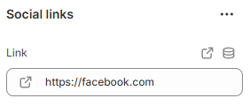

---
metaLinks:
  alternates:
    - >-
      https://app.gitbook.com/s/hbuQuZovtBBsMP54qBxh/footer-group/footer/footer-branding/social-links/social-link-block
---

# Social link block

<figure><figcaption></figcaption></figure>

**Link:** Add a URL to make the entire icon clickable.
