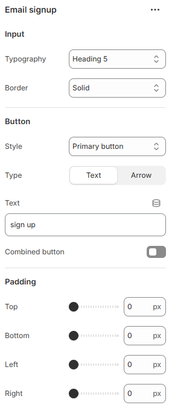

---
metaLinks:
  alternates:
    - >-
      https://app.gitbook.com/s/hbuQuZovtBBsMP54qBxh/footer-group/footer/newsletter/email-signup
---

# Email Signup

Email Signup is used to collect customer email addresses. It helps grow your mailing list for updates and promotions.

<figure><figcaption></figcaption></figure>

|                 |                                                                                                                                                                            |
| --------------- | -------------------------------------------------------------------------------------------------------------------------------------------------------------------------- |
| **Input**       |                                                                                                                                                                            |
| Typography      | Select the option from the typography. According to the selected option you will be adjusted to the font family and font size.                                             |
| Border          | Select the style of the border. ( None, Solid, Underline )                                                                                                                 |
| **Button**      |                                                                                                                                                                            |
| Style           | 
Select the button style. (Primary, Secondary, Link)
 Note: According to the selected button style, the button background and hover background color get changed.
 |
| Type            | Select the type of the submit button. (Text, Arrow)                                                                                                                        |
| Text            | Add the text for the submit button                                                                                                                                         |
| Combined button | Enable to view the input & button together.                                                                                                                                |
| Padding         | Adjust the padding range around the section. (Top, Bottom, Left, Right)                                                                                                    |
