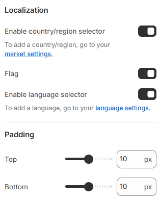

---
metaLinks:
  alternates:
    - https://app.gitbook.com/s/hbuQuZovtBBsMP54qBxh/header-group/announcement
---

# Announcement

This section is to add text about any vital announcement on the site. Enhance customer experience by using the Announcement Bar Section to display special offers, announcements or updates at the top of your storefront.

1. Go to **Shopify Admin > Online Store > Themes.**
2. Click **Customize** on your active theme.
3. In the theme editor, click **Add Section > Announcement Bar**.
4. Click **Save.**

<figure><figcaption></figcaption></figure> <figure><figcaption></figcaption></figure>

| **Layout**                     | ​                                                                                                                 |
| ------------------------------ | ----------------------------------------------------------------------------------------------------------------- |
| Full width                     | Enable for full width view.(Controls the container width)                                                         |
| Color scheme                   | Select any color scheme defined in the theme settings > Colors > Schemes.                                         |
| Hide on mobile                 | This option to hide the announcement bar on mobile devices.                                                       |
| Dividers                       | Enable divider. ( To view the separator line below the announcement bar )                                         |
| **Carousel settings**          |                                                                                                                   |
| Change every slide             | Range 0 to 10s                                                                                                    |
| Enable navigation              | Enable to display navigation icon.                                                                                |
| Border                         | ​Select the border style.                                                                                         |
| Thickness                      | Adjust the thickness.                                                                                             |
| Opacity                        | Adjust the opacity range.                                                                                         |
| Corner radius                  | Adjust the corner radius of the cart image.                                                                       |
| Inherit color scheme           | Inherit the color scheme from the global theme settings.                                                          |
| **Localization**               | ​                                                                                                                 |
| Enable country/region selector | Allow customers to switch between different countries or regions. To add countries/regions, Go to your > Markets. |
| Enable flag                    | To view the flag of the selected country.                                                                         |
| Enable language selector       | Allow customers to switch languages. To configure languages, go to Settings > Languages in your Shopify admin.    |

