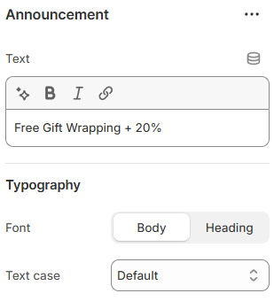

---
metaLinks:
  alternates:
    - >-
      https://app.gitbook.com/s/hbuQuZovtBBsMP54qBxh/header-group/announcement/announcement-block
---

# Announcement Block

An Announcement Block is used to display important messages or updates on your store. It helps highlight offers, notices, or timely information for customers.

<figure><figcaption></figcaption></figure>

| Text           | Add the message to display in the announcement bar.                               |
| -------------- | --------------------------------------------------------------------------------- |
| **Typography** | ​                                                                                 |
| Font           | Font family can be selected from the options.(Body, Heading)                      |
| Testcase       | Font text-type can be selected from the options. (Default, Uppercase, Capitalize) |
