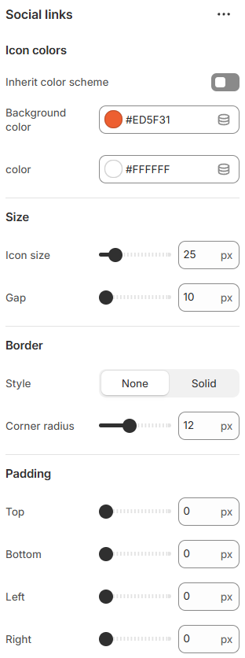

---
metaLinks:
  alternates:
    - >-
      https://app.gitbook.com/s/hbuQuZovtBBsMP54qBxh/header-group/announcement/social-links
---

# Social Links

Social Links allow you to connect your store with your social media profiles. They help customers find and follow your brand across social platforms.

<figure><figcaption></figcaption></figure>

|                      |                                                                          |
| -------------------- | ------------------------------------------------------------------------ |
| **Icon colors**      |                                                                          |
| Inherit color scheme | Inherit the color scheme from the global theme settings.                 |
| Background color     | Pick the color for the background.                                       |
| color                | Pick the color for the social link text.                                 |
| **Size**             |                                                                          |
| Icon size            | Adjust the icon size.                                                    |
| Gap                  | Adjust the gap between the icon.                                         |
| **Border**           |                                                                          |
| Style                | Select the style of the border.                                          |
| Corner radius        | Adjust the corner radius width.                                          |
| Padding              | Adjust the padding range around the content. (Top, Bottom, Left, Right ) |

