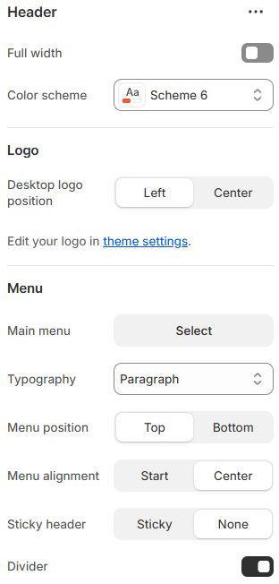
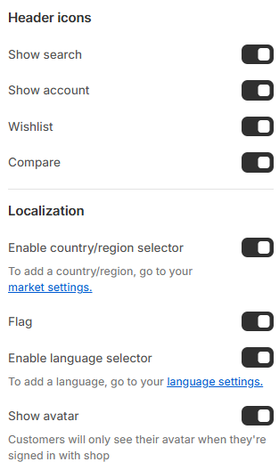

---
metaLinks:
  alternates:
    - https://app.gitbook.com/s/hbuQuZovtBBsMP54qBxh/header-group/header
---

# Header

Every page has a header section that contains the logo, icons, navigation, and optional selectors. It enhances the desktop and mobile user experience and guarantees quick access to crucial links.

* Go to Online Store> click **Home Page** in drop-down
* Locate **Header** on the left-side
* Make necessary change on the right-side
* Click **Save.**

<figure><figcaption></figcaption></figure> <figure><figcaption></figcaption></figure>

|                                |                                                                                                                                |
| ------------------------------ | ------------------------------------------------------------------------------------------------------------------------------ |
| Full width                     | 
Enable for full width view. 

(Controls the container width)
                                                       |
| Color scheme                   | Select any color scheme defined in the theme settings > Colors > Schemes.                                                      |
| **Logo**                       |                                                                                                                                |
| Desktop logo position          | Select how your logo will appear on the desktop. (Left, Center)                                                                |
| **Menu**                       |                                                                                                                                |
| Main menu                      | Choose the navigation menu to appear in the header. Manage menus under Online Store > Content > Menu.                          |
| Typography                     | Select the option from the typography. According to the selected option you will be adjusted to the font family and font size. |
| Menu position                  | 
Choose the position of the menu. 

(Top, Bottom)
                                                                   |
| Menu alignment                 | Select the menu alignment. (Left, Center)                                                                                      |
| Sticky header                  | Allow the header to remain displayed while scrolling. (Sticky, None)                                                           |
| Divider                        | Enable divider. (To view the separator line below the header)                                                                  |
| **Header icons**               |                                                                                                                                |
| Show search                    | Enable this option to display the search icon on the header.                                                                   |
| Show account                   | Enable this option to display the account icon on the header.                                                                  |
| Wishlist                       | Enable this option to display the wishlist icon on the header.                                                                 |
| Compare                        | Enable this option to display the compare icon on the header.                                                                  |
| **Localization**               |                                                                                                                                |
| Enable country/region selector | 
Allows customer to switch between different countries or regions.
 To add countries/regions, Go to your > Markets.
   |
| Flag                           | To view the flag of the selected country.                                                                                      |
| Enable language selector       | 
Allows customer to switch languages.
 To configure languages, go to Settings > Languages in your Shopify admin.
      |
| Show avator                    | Displays customer avatar when logged in. Only visible if the customer is signed in.                                            |

