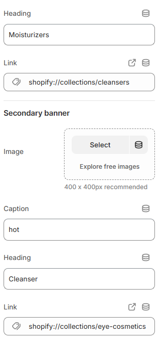

---
metaLinks:
  alternates:
    - >-
      https://app.gitbook.com/s/hbuQuZovtBBsMP54qBxh/header-group/header/promo-banner
---

# Promo banner

A grid of promotional images can be added to the navigation mega menu using the Promo Banner section. Usually, it features collections, sales, or highlighted items together with pictures, descriptions, and links.

* Go to Online Store> click **Home Page** in drop-down
* Locate **Header** > click **Promo banner** on the left-side
* Make necessary change on the right-side
* Click **Save.**

<figure><figcaption></figcaption></figure> <figure><figcaption></figcaption></figure>

| **Promo banner**      | ​                                                                                                                                                             |
| --------------------- | ------------------------------------------------------------------------------------------------------------------------------------------------------------- |
| Map item (Collection) | Use the top-level menu handle from your main menu to link this promo banner to a mega menu item. Hyphens (-) are used in place of spaces.                     |
| Banner style          | Banner style is used to align the banner images on the mega menu. (Both side, Start, End)Note: Only once you upload the images below do styling options show. |
| Color scheme          | Theme Settings > Colors > Schemes allows you to select from pre-made color schemes.                                                                           |
| **Primary banner**    | ​                                                                                                                                                             |
| Image                 | Add a image to the primary banner.                                                                                                                            |
| Caption               | Add the caption.                                                                                                                                              |
| Heading               | Main title of the banner.                                                                                                                                     |
| Link                  | Add the link for the banner image                                                                                                                             |
| **Secondary banner**  | ​                                                                                                                                                             |
| Image                 | Add a image to the secondary banner.                                                                                                                          |
| Caption               | Add the caption.                                                                                                                                              |
| Heading               | Main title of the banner.                                                                                                                                     |
| Link                  | Add the link for the banner image                                                                                                                             |
