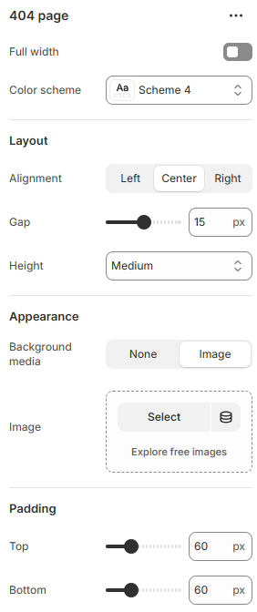

---
metaLinks:
  alternates:
    - https://app.gitbook.com/s/hbuQuZovtBBsMP54qBxh/inner-pages/404-page
---

# 404 page

When a customer tries to visit a link to your site that doesn’t exist, such as a product page for a product that you deleted from your store.

1. Go to **Customize** theme. Click on the top dropdown menu to select the **Others > 404 page** template.
2. From the left side menu, select **“404 page”.**
3. Customize this section by adding the text to display on the **“404 page”.**

<figure><figcaption></figcaption></figure>

|                  |                                                                              |
| ---------------- | ---------------------------------------------------------------------------- |
| Full width       | Enable for full-width view. (Controls the container width)                   |
| Color scheme     | Select any color scheme defined in the theme settings > Colors > Schemes.    |
| **Layout**       |                                                                              |
| Alignment        | Choose the alignment of the text. (Left, Center, Right)                      |
| Gap              | Adjust the spacing between the content.                                      |
| Height           | Select the height for the section. (Small, Medium, Large)                    |
| **Appearance**   |                                                                              |
| Background media | Select the background type.                                                  |
| Image            | Add the image to the background.                                             |
| Padding          | Adjust the vertical padding of the section to control spacing. (Top, Bottom) |
