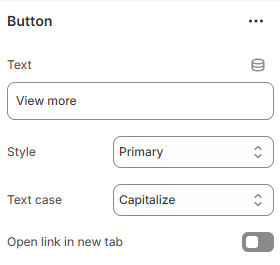

---
metaLinks:
  alternates:
    - >-
      https://app.gitbook.com/s/hbuQuZovtBBsMP54qBxh/inner-pages/blog-post/blog-card/button
---

# Button

<figure><figcaption></figcaption></figure>

|                      |                                                                                                                                                                             |
| -------------------- | --------------------------------------------------------------------------------------------------------------------------------------------------------------------------- |
| Text                 | Add the text to the button                                                                                                                                                  |
| Style                | 
Select the button style. (Primary, Secondary, Link ) 

Note: According to the selected button style, button background and hover background color gets changed.
 |
| Text case            | Use the Text case setting to adjust the text style. (Uppercase, Capitalize, Default)                                                                                        |
| Open link in new tab | Enable to open the link in a new browser tab.                                                                                                                               |
