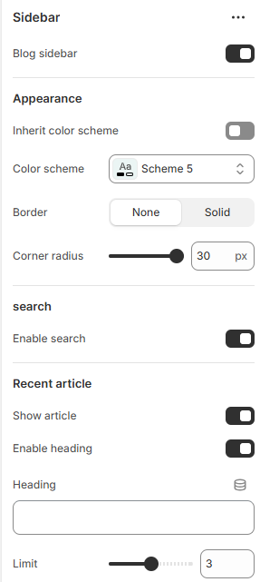

---
metaLinks:
  alternates:
    - >-
      https://app.gitbook.com/s/hbuQuZovtBBsMP54qBxh/inner-pages/blog-post/sidebar
---

# Sidebar

The Sidebar section is used to display supporting content alongside the main page area. It’s ideal for adding navigation links, filters, promotional content, or additional information, helping customers access key elements quickly without leaving the page.

<figure><figcaption></figcaption></figure> <figure><figcaption></figcaption></figure>

|                      |                                                                           |
| -------------------- | ------------------------------------------------------------------------- |
| Blog sidebar         | Enable to view the sidebar.                                               |
| **Appearance**       |                                                                           |
| Inherit color scheme | Inherit the color scheme from the global theme settings.                  |
| Color scheme         | Select any color scheme defined in the theme settings > Colors > Schemes. |
| Border               | Select the border style.                                                  |
| **Search**           |                                                                           |
| Enable search        | Enable search on the sidebar.                                             |
| **Recent article**   |                                                                           |
| Show article         | Enable to show article.                                                   |
| Enable heading       | Enable to show article heading on the sidebar.                            |
| Heading              | Add the text to the heading.                                              |
| Limit                | Adjust the limit of the article.                                          |
| **Tag**              |                                                                           |
| Show tags            | Enable to show tags.                                                      |
| Enable heading       | Enable to show the heading on the sidebar.                                |
| Heading              | Add the text to the heading.                                              |
| **Collection**       |                                                                           |
| Show collection      | Enable to show the collection.                                            |
| Collection           | Add the collection.                                                       |
| **Promo**            |                                                                           |
| Show promo image     | Enable to show the promo image.                                           |
