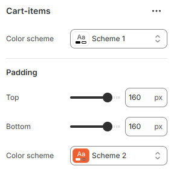

---
metaLinks:
  alternates:
    - https://app.gitbook.com/s/hbuQuZovtBBsMP54qBxh/inner-pages/cart-item
---

# Cart Item

The **Cart Page** displays all items a customer has added to their cart before checkout. It allows customers to review products, update quantities, remove items, and view order totals, ensuring clarity and a smooth transition to checkout.

<figure><figcaption></figcaption></figure>

|              |                                                                                                                                          |
| ------------ | ---------------------------------------------------------------------------------------------------------------------------------------- |
| Color scheme | Select any color scheme defined in the theme settings > Colors > Schemes.                                                                |
| Padding      | Adjust the vertical padding of the section to control spacing. (Top, Bottom)                                                             |
| Color scheme | 
Select any color scheme defined in the theme settings > Colors > Schemes. Note: Select the color for the shipping information.
 |
