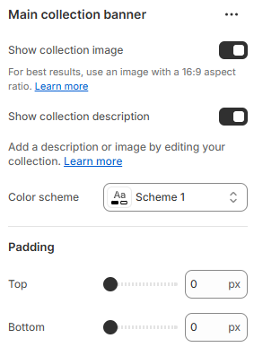

---
metaLinks:
  alternates:
    - >-
      https://app.gitbook.com/s/hbuQuZovtBBsMP54qBxh/inner-pages/main-collection/collection-banner
---

# Collection banner

The Collection Banner section highlights the collection title, description, and featured image at the top of collection pages. It helps create a strong visual introduction and context for your product collections.

1. Go to **Shopify Admin > Online Store > Themes**.
2. Click **Customize** on your active theme.
3. In the Theme Editor, go to **Collection** > **Add Section** > **Collection Banner**.

<figure><figcaption></figcaption></figure>

|                             |                                                                           |
| --------------------------- | ------------------------------------------------------------------------- |
| Show collection image       | Enable collection image on the banner.                                    |
| Show collection description | Enable collection description on the banner.                              |
| Color scheme                | Select any color scheme defined in the theme settings > Colors > Schemes. |
