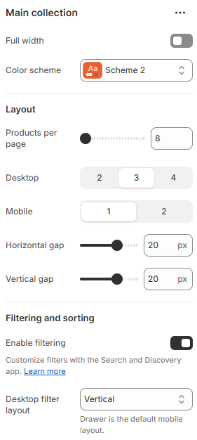
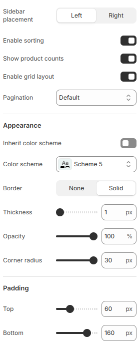

---
metaLinks:
  alternates:
    - >-
      https://app.gitbook.com/s/hbuQuZovtBBsMP54qBxh/inner-pages/main-collection/main-collection
---

# Main collection

<figure><figcaption></figcaption></figure> <figure><figcaption></figcaption></figure>

|                           |                                                                           |
| ------------------------- | ------------------------------------------------------------------------- |
| Full width                | Enable for full width view. (Controls the container width)                |
| Color scheme              | Select any color scheme defined in the theme settings > Colors > Schemes. |
| **Layout**                |                                                                           |
| Products per page         | Adjust the range to display the total count of the products.              |
| Desktop                   | Control the number of products shown per row on desktop view.             |
| Mobile                    | Control the number of products shown per row on mobile view.              |
| Horizontal gap            | Adjust the spacing range between the collection card.                     |
| Vertical gap              | Adjust the spacing range top and bottom of  the collection card.          |
| **Filtering and Sorting** |                                                                           |
| Enable filtering          | Enable to view the filter on this page.                                   |
| Desktop filter layout     | Select the type of the filter layout. (Horizontal, Vertical, Drawer)      |
| Sidebar placement         | Select the placement of the sidebar.                                      |
| Enable sorting            | Enable to sort the collection.                                            |
| Show product counts       | Show the total count of the products on the filter.                       |
| Enable grid layout        | Enable to view the grid layout.                                           |
| Pagination                | Select the pagination type. (Loadmore, Scrolling, Default)                |
| **Appearence**            |                                                                           |
| Inherit color scheme      | Inherit the color scheme from the global theme settings.                  |
| Color scheme              | Select any color scheme defined in the theme settings > Colors > Schemes. |
| Border                    | Select the border type.                                                   |
| Thickness                 | Adjust the thickness of the border.                                       |
| Opacity                   | Adjust the opacity of the border.                                         |
| Corner radius             | Adjust the corner radius of the border.                                   |
| Padding                   | Adjust the padding range around the section. (Top, Bottom, Left, Right)   |
