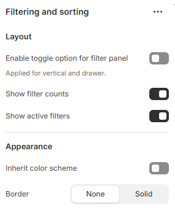

---
metaLinks:
  alternates:
    - >-
      https://app.gitbook.com/s/hbuQuZovtBBsMP54qBxh/inner-pages/main-collection/main-collection/filtering-and-sorting
---

# Filtering and sorting

<figure><figcaption></figcaption></figure>

|                                       |                                                          |
| ------------------------------------- | -------------------------------------------------------- |
| Enable toggle option for filter panel | Enable the toggle option to display on the filter.       |
| Show filter counts                    | Enable the display of the product count on the filter.   |
| Show active filters                   | Enable to show active filter of the selected options.    |
| **Appearence**                        |                                                          |
| Inherit color scheme                  | Inherit the color scheme from the global theme settings. |
| Border                                | Select the border style.                                 |
