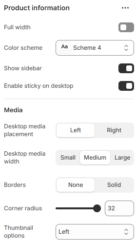
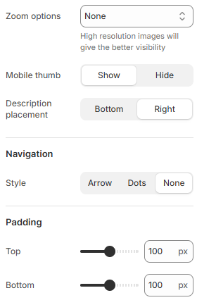

---
metaLinks:
  alternates:
    - https://app.gitbook.com/s/hbuQuZovtBBsMP54qBxh/inner-pages/main-product
---

# Main Product

The **Main Product** section in Shopify is where you configure how a product appears on the **Product Detail Page** (PDP). It controls everything from product title and price to images, buttons, and more.

1. Go to **Online Store > Themes > Customize.**
2. In the theme editor, click the **top dropdown menu.**
3. Select **Products > Default Product.**
4. On the **left side panel**, click on **Product Information.**

<figure><figcaption></figcaption></figure> <figure><figcaption></figcaption></figure>

|                          |                                                                                      |
| ------------------------ | ------------------------------------------------------------------------------------ |
| Full width               | Enable for full width view. (Controls the container width)                           |
| Color scheme             | Select any color scheme defined in the theme settings > Colors > Schemes.            |
| Show sidebar             | Enable to view the sidebar.                                                          |
| Enable sticky on desktop | Enable to make the sidebar sticky on desktop view.                                   |
| **Media**                |                                                                                      |
| Desktop media placement  | Select the position of the desktop media. (Left, Right)                              |
| Desktop media width      | Adjust the width of the product image for the desktop layout. (Small, Medium, Large) |
| Borders                  | Select the border style. (Solid, None)                                               |
| Corner radius            | Adjust the corner radius of the media.                                               |
| Thumbnail options        | Choose the thumbnail layout. (Stacked, Horizontal, Vertical)                         |
| Zoom options             | Enable to view the product with zoom option.                                         |
| Mobile thumb             | Select to show the thumb image on mobile.                                            |
| Description placement    | Select the position of the accordian content. (Bottom, Right)                        |
| **Navigation**           |                                                                                      |
| Style                    | Choose pagination style. (Dots, Arrow, None )                                        |
| Padding                  | Adjust the vertical padding of the section to control spacing. (Top, Bottom)         |
