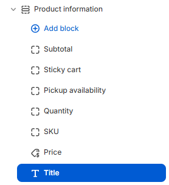

---
metaLinks:
  alternates:
    - >-
      https://app.gitbook.com/s/hbuQuZovtBBsMP54qBxh/inner-pages/main-product/blocks
---

# Blocks

<figure><figcaption></figcaption></figure>

For the above-listed blocks, we are not supposed to edit the value or customize it. Just adding the block to the product information section, it will fetch the data from the backend of the product.
