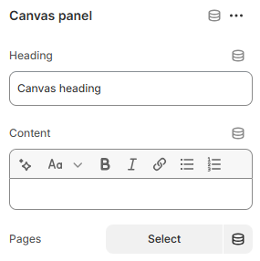

---
metaLinks:
  alternates:
    - >-
      https://app.gitbook.com/s/hbuQuZovtBBsMP54qBxh/inner-pages/main-product/canvas-panel
---

# Canvas Panel

<figure><figcaption></figcaption></figure>

|         |                                             |
| ------- | ------------------------------------------- |
| Heading | Add the text.                               |
| Content | Add the content/description for this block. |
| Pages   | Add the page to display the page content.   |

Note: Like the canvas panel, it looks the same for the size chart block, tab content block, text block and accordion panel block.
