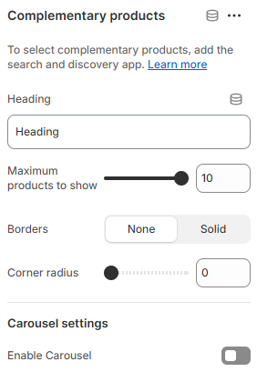

---
metaLinks:
  alternates:
    - >-
      https://app.gitbook.com/s/hbuQuZovtBBsMP54qBxh/inner-pages/main-product/complementary-products
---

# Complementary Products

The **Complementary Products** section displays related or add-on items alongside a product. It’s ideal for encouraging upsells and cross-sells by suggesting items that pair well with the main product, helping increase average order value and improve the shopping experience.

<figure><figcaption></figcaption></figure>

|                          |                                                       |
| ------------------------ | ----------------------------------------------------- |
| Heading                  | Add the heading text for the complementary block.     |
| Maximum products to show | Adjust the range of the product to show on the block. |
| Borders                  | Select the border type.                               |
| **Carousel settings**    |                                                       |
| Enable carousel          | Enable to swipe the products.                         |

[**How to create a complementary?**](https://wedesigntech-1.gitbook.io/framework/apps/complementary)
