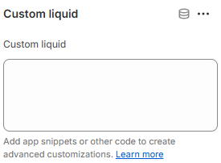

---
metaLinks:
  alternates:
    - >-
      https://app.gitbook.com/s/hbuQuZovtBBsMP54qBxh/inner-pages/main-product/custom-liquid
---

# Custom Liquid

The **Custom Liquid** section allows you to add your own Liquid code directly within the theme editor. It’s ideal for inserting custom content, third-party scripts, or advanced layouts when built-in sections don’t meet specific requirements.

<figure><figcaption></figcaption></figure>
