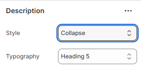

---
metaLinks:
  alternates:
    - >-
      https://app.gitbook.com/s/hbuQuZovtBBsMP54qBxh/inner-pages/main-product/description
---

# Description

The **Description** section is used to display detailed product or page content in a clear and readable format. It helps communicate important information, features, and benefits, giving customers a better understanding before making a decision.

<figure><figcaption></figcaption></figure>

Style - Select the style of the block.

Typography - Select the option from the typography. According to the selected option, you will be adjusted to the font family and font size.
