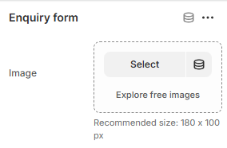

---
metaLinks:
  alternates:
    - >-
      https://app.gitbook.com/s/hbuQuZovtBBsMP54qBxh/inner-pages/main-product/enquiry-form
---

# Enquiry Form

The **Enquiry Form** section allows customers to submit questions or requests directly from the product or page. It’s ideal for custom orders, bulk enquiries, or pre-purchase questions, helping you capture leads and respond efficiently.

<figure><figcaption></figcaption></figure>

By adding the enquiry form block, the form gets added. Then we can customize the image for the form.
