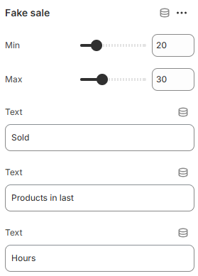

---
metaLinks:
  alternates:
    - >-
      https://app.gitbook.com/s/hbuQuZovtBBsMP54qBxh/inner-pages/main-product/fake-sale
---

# Fake Sale

The **Fake Sale** is used to highlight promotional-style offers by displaying original and discounted prices to create a sale-like visual effect. It’s typically used for marketing emphasis, limited-time offers, or to draw attention to specific products or collections.

<figure><figcaption></figcaption></figure>

|      |                                        |
| ---- | -------------------------------------- |
| Min  | Minimum products to show on fake sale. |
| Max  | Maximum products to show on fake sale. |
| Text | Add text to the fake sales block.      |
