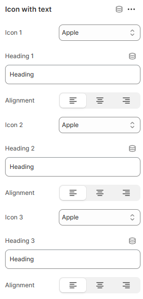

---
metaLinks:
  alternates:
    - >-
      https://app.gitbook.com/s/hbuQuZovtBBsMP54qBxh/inner-pages/main-product/icon-with-text
---

# Icon With Text

The **Image with Text** section allows you to display an image alongside text, creating a visually appealing layout that enhances storytelling, promotions, or brand messaging.

<figure><figcaption></figcaption></figure>

|           |                                                         |
| --------- | ------------------------------------------------------- |
| Icon 1    | Choose the icon.                                        |
| Heading 1 | Add the text for the heading.                           |
| Alignment | Choose the alignment of the icon. (Left, Center, Right) |
