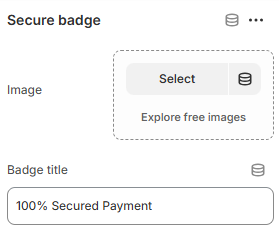

---
metaLinks:
  alternates:
    - >-
      https://app.gitbook.com/s/hbuQuZovtBBsMP54qBxh/inner-pages/main-product/secure-badge
---

# Secure Badge

The **Secure Badge** section is used to display trust and security icons, reassuring customers that their payments and personal information are safe. It helps build confidence during browsing and checkout, improving overall trust in your store.

<figure><figcaption></figcaption></figure>

|             |                                      |
| ----------- | ------------------------------------ |
| Image       | Add image for the secure badge.      |
| Badge title | Add the title text for secure badge. |
