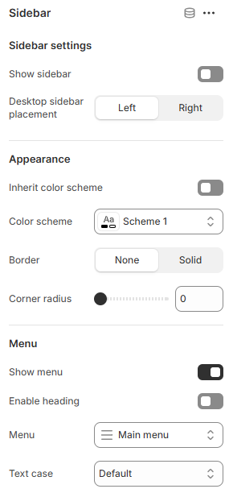
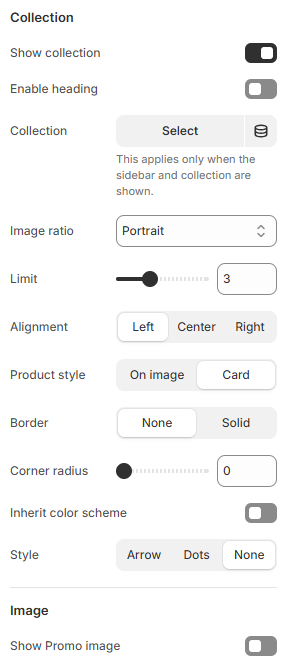

---
metaLinks:
  alternates:
    - >-
      https://app.gitbook.com/s/hbuQuZovtBBsMP54qBxh/inner-pages/main-product/sidebar
---

# Sidebar

The **Sidebar** section is used to display supporting content alongside the main page area. It’s ideal for adding navigation links, filters, promotional content, or additional information, helping customers access key elements quickly without leaving the page.

<figure><figcaption></figcaption></figure> <figure><figcaption></figcaption></figure>

|                           |                                                                                      |
| ------------------------- | ------------------------------------------------------------------------------------ |
| **Sidebar settings**      |                                                                                      |
| Show sidebar              | Enable to view the sidebar.                                                          |
| Desktop sidebar placement | Select the position of the sidebar.                                                  |
| **Appearance**            |                                                                                      |
| Inherit color scheme      | Inherit the color scheme from the global theme settings.                             |
| Color scheme              | Select any color scheme defined in the theme settings > Colors > Schemes.            |
| Border                    | Select the border style.                                                             |
| **Menu**                  |                                                                                      |
| Show menu                 | Enable to show menu on the sidebar.                                                  |
| Enable heading            | Enable to show menu heading on the sidebar.                                          |
| Menu                      | Select the menu for the sidebar.                                                     |
| Text case                 | Use the Text case setting to adjust the text style. (Uppercase, Capitalize, Default) |
| **Collection**            |                                                                                      |
| Show collection           | Enable to show collection on the sidebar.                                            |
| Enable heading            | Enable to show collection heading on the sidebar.                                    |
| Collection                | Select the collection for the sidebar.                                               |
| Image ratio               | Select the image ratio.&#xD;(Adapt, Portrait, Square, Landscape)                     |
| Limit                     | Adjust the limit of the product to show in the collection.                           |
| Alignment                 | 
Choose the alignment of the text on desktop.
 (Left, Center, Right)
        |
| Product style             | Select the product style.                                                            |
| Border                    | Select the style of the border.                                                      |
| Corner radius             | Select the style of the border.                                                      |
| Inherit color scheme      | Inherit the color scheme from the global theme settings.                             |
| Pagination                | Choose the pagination style.                                                         |
| **Image**                 |                                                                                      |
| Show Promo image          | Enable to show promo image on the sidebar.                                           |
