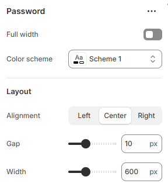

---
metaLinks:
  alternates:
    - https://app.gitbook.com/s/hbuQuZovtBBsMP54qBxh/inner-pages/password
---

# Password

The password page displays when password protection is enabled on your online store and a customer tries to visit your website.

<figure><figcaption></figcaption></figure>

| Expand to full width | Enable for full width view. (Controls the container width)                |
| -------------------- | ------------------------------------------------------------------------- |
| Color scheme         | Select any color scheme defined in the theme settings > Colors > Schemes. |
| **Layout**           |                                                                           |
| Alignment            | Choose the alignment of the text. (Left, Center, Right)                   |
| Gap                  | Adjust the spacing between the contents.                                  |
| Width                | Adjust the range for the width.                                           |
