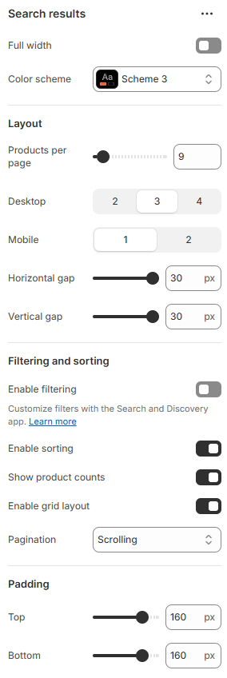

---
metaLinks:
  alternates:
    - https://app.gitbook.com/s/hbuQuZovtBBsMP54qBxh/inner-pages/search-results
---

# Search Results

The search page is where customers can search for specific products or pages within your online store. The page contains a **Search results** section by default.

1. Go to **Customize** theme. Click on the top dropdown menu to select the **Others > Search** template.
2. From the left side menu, select **“Search results”.**
3. Customize this section by using the settings described in the following table:

<figure><figcaption></figcaption></figure>

|                           |                                                                              |
| ------------------------- | ---------------------------------------------------------------------------- |
| Full width                | Enable for full-width view. (Controls the container width)                   |
| Color scheme              | Select any color scheme defined in the theme settings > Colors > Schemes.    |
| **Layouts**               |                                                                              |
| Products per page         | Adjus the range to show the product card on the search page.                 |
| Desktop                   | Control the number of products shown per row on desktop view.                |
| Mobile                    | Control the number of products shown per row on mobile view.                 |
| Horizontal gap            | Adjust the spacing range between the product card.                           |
| Vertical gap              | Adjust the spacing range top and bottom of the product card.                 |
| **Filtering and sorting** |                                                                              |
| Enable sorting            | Enable to view the filter on this page.                                      |
| Show product counts       | Show the total count of the products on the filter.                          |
| Enable grid layout        | Enable to view the grid layout.                                              |
| Pagination                | Select the pagination type. (Loadmore, Scrolling, Default)                   |
| Padding                   | Adjust the vertical padding of the section to control spacing. (Top, Bottom) |

