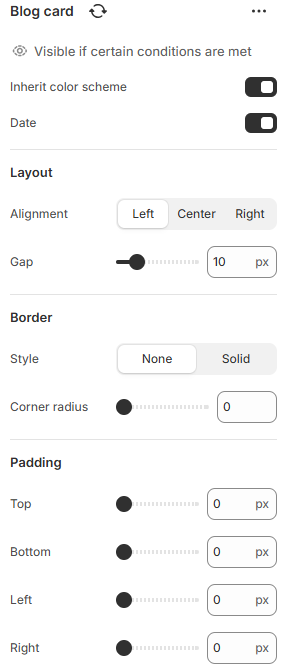

---
metaLinks:
  alternates:
    - >-
      https://app.gitbook.com/s/hbuQuZovtBBsMP54qBxh/inner-pages/search-results/blog-card
---

# Blog card

<figure><figcaption></figcaption></figure>

|                      |                                                                         |
| -------------------- | ----------------------------------------------------------------------- |
| Inherit color scheme | Inherit the color scheme from the global theme settings.                |
| Date                 | Enable date to show post date on the blog.                              |
| **Layout**           |                                                                         |
| Alignment            | Choose the alignment of the text.&#xD; (Left, Center, Right)            |
| Gap                  | Adjust the space between the contents.                                  |
| **Border**           |                                                                         |
| Style                | Select the border style.                                                |
| Corner radius        | Adjust the corner radius width.                                         |
| Padding              | Adjust the padding range around the content. (Top, Bottom, Left, Right) |
