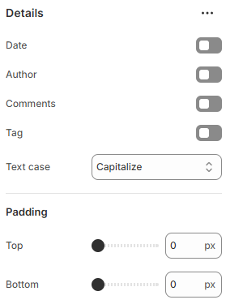

---
metaLinks:
  alternates:
    - >-
      https://app.gitbook.com/s/hbuQuZovtBBsMP54qBxh/inner-pages/search-results/blog-card/details
---

# Details

<figure><figcaption></figcaption></figure>

|           |                                                                                      |
| --------- | ------------------------------------------------------------------------------------ |
| Date      | Enable date to show date on the blog post.                                           |
| Author    | Enable author to show date on the blog post.                                         |
| Comments  | Enable comments to show date on the blog post.                                       |
| Tag       | Enable tag to show date on the blog post.                                            |
| Text case | Use the Text case setting to adjust the text style. (Uppercase, Capitalize, Default) |
| Padding   | Adjust the vertical padding of the section to control spacing. (Top, Bottom)         |
