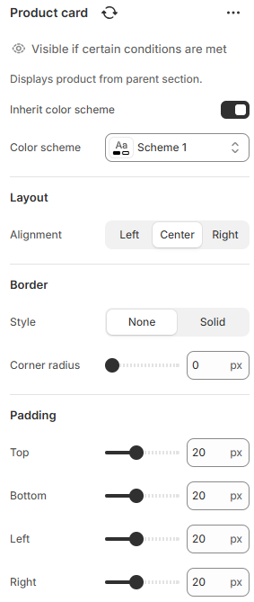

---
metaLinks:
  alternates:
    - >-
      https://app.gitbook.com/s/hbuQuZovtBBsMP54qBxh/inner-pages/search-results/product-card
---

# Product card

Displays individual product details, including image, title, price, and action buttons, within a product listing or section.

<figure><figcaption></figcaption></figure>

| Inherit color scheme | Inherit the color scheme from the global theme settings.                     |
| -------------------- | ---------------------------------------------------------------------------- |
| Color scheme         | Select any color scheme defined in the theme settings > Colors > Schemes.    |
| **Layout**           |                                                                              |
| Alignment            | 
Choose the alignment of the text.
 (Left, Center, Right)
           |
| **Borders**          | ​                                                                            |
| Style                | Select the style of the border.                                              |
| Corner radius        | Adjust the corner radius width of the border.                                |
| Padding              | Adjust the vertical padding of the section to control spacing. (Top, Bottom) |
