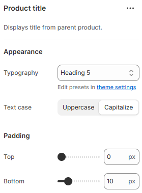

---
metaLinks:
  alternates:
    - >-
      https://app.gitbook.com/s/hbuQuZovtBBsMP54qBxh/inner-pages/search-results/product-card/product-title
---

# Product Title

<figure><figcaption></figcaption></figure>

|            |                                                                                                                                |
| ---------- | ------------------------------------------------------------------------------------------------------------------------------ |
| Typography | Select the option from the typography. According to the selected option you will be adjusted to the font family and font size. |
| Text case  | Use the Text case setting to adjust the text style. (Uppercase, Capitalize, Default)                                           |
| Padding    | Adjust the vertical padding of the block to control spacing. (Top, Bottom)                                                     |
