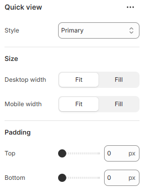

---
metaLinks:
  alternates:
    - >-
      https://app.gitbook.com/s/hbuQuZovtBBsMP54qBxh/inner-pages/search-results/product-card/quick-view
---

# Quick view

Allows customers to preview product details in a popup without leaving the current page.

<figure><figcaption></figcaption></figure>

|               |                                                                                                                                                                             |
| ------------- | --------------------------------------------------------------------------------------------------------------------------------------------------------------------------- |
| Style         | 
Select the button style. (Primary, Secondary, Link )
 Note: According to the selected button style, the button background and hover background color get changed.
 |
| **Size**      |                                                                                                                                                                             |
| Desktop width | Set the button width for desktop view. (Fit, Fill)                                                                                                                          |
| Mobile width  | Set the button width for mobile view. (Fit, Fill)                                                                                                                           |
| Padding       | Adjust the vertical padding of the section to control spacing. (Top, Bottom)                                                                                                |
