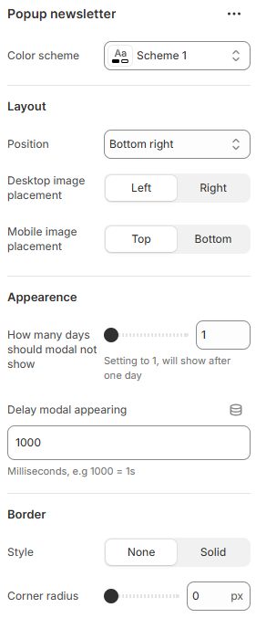

---
metaLinks:
  alternates:
    - >-
      https://app.gitbook.com/s/hbuQuZovtBBsMP54qBxh/overlay-group/popup-newsletter
---

# Popup Newsletter

<figure><figcaption></figcaption></figure>

|                                     |                                                                           |
| ----------------------------------- | ------------------------------------------------------------------------- |
| Color scheme                        | Select any color scheme defined in the theme settings > Colors > Schemes. |
| **Layout**                          |                                                                           |
| Position                            | Select the position to display the section. (Left, Right)                 |
| Desktop image placement             | Select the position of the image on the desktop. (Left, Right)            |
| Mobile image placement              | Select the position of the image on the mobile. (Top, Bottom)             |
| **Appearence**                      |                                                                           |
| How many days should modal not show | Set how many days the popup should stay hidden after a user closes it.    |
| Delay modal appearing               | Set the delay before the popup appears.                                   |
| **Border**                          |                                                                           |
| Style                               | Select the border style.                                                  |
| Corner radius                       | Adjust the corner radius width.                                           |
