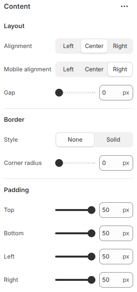

---
metaLinks:
  alternates:
    - >-
      https://app.gitbook.com/s/hbuQuZovtBBsMP54qBxh/overlay-group/popup-newsletter/content
---

# Content

<figure><figcaption></figcaption></figure>

|                  |                                                                               |
| ---------------- | ----------------------------------------------------------------------------- |
| **Layout**       |                                                                               |
| Alignment        | 
Choose the alignment of the text on desktop.
 (Left, Center, Right)
 |
| Mobile alignment | 
Choose the alignment of the text on mobile.
 (Left, Center, Right)
  |
| Gap              | Adjust the gap between the contents.                                          |
| **Border**       |                                                                               |
| Style            | Select the style of the border.                                               |
| Corner radius    | Adjust the corner radius width.                                               |
| Padding          | 
Adjust the padding to control spacing.
 (Top, Bottom, Left, Right)
  |
