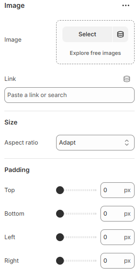

---
metaLinks:
  alternates:
    - >-
      https://app.gitbook.com/s/hbuQuZovtBBsMP54qBxh/overlay-group/popup-newsletter/image
---

# Image

An Image is used to display visual content in your store. It helps showcase products, branding, or supporting visuals clearly.

<figure><figcaption></figcaption></figure>

|              |                                                                      |
| ------------ | -------------------------------------------------------------------- |
| Image        | Add the image to the card.                                           |
| Link         | Add a URL to make the entire image clickable.                        |
| **Size**     |                                                                      |
| Aspect ratio | Select the image ratio. (Adapt, Portrait, Square, Landscape)         |
| Padding      | Adjust the padding range around the card. (Top, Bottom, Left, Right) |
