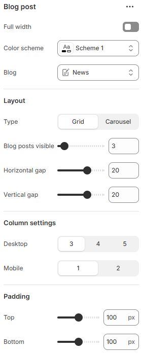

---
metaLinks:
  alternates:
    - https://app.gitbook.com/s/hbuQuZovtBBsMP54qBxh/sections/blog-post
---

# Blog Post

**The Blog Template** is used to design and structure your blog listing page, where all your blog articles (posts) under a specific blog name (like "News" or "Journal") are displayed.

<figure><figcaption></figcaption></figure>

|                         |                                                                              |
| ----------------------- | ---------------------------------------------------------------------------- |
| Full width              | Enable for full width view. (Controls the container width)                   |
| Color scheme            | Select any color scheme defined in the theme settings > Colors > Schemes.    |
| Blog                    | Select the blog collection.                                                  |
| **Layout**              |                                                                              |
| Type Blog posts visible | Select the layout type. (Grid, Carousel)                                     |
| Horizontal gap          | Adjust the spacing range between the blog cards.                             |
| Vertical gap            | Adjust the spacing above & below the blog cards.                             |
| **Column settings**     |                                                                              |
| Desktop                 | Select the number of blog card to show on the desktop view.                  |
| Mobile                  | Select the number of blog card to show on the mobile view.                   |
| Padding                 | Adjust the vertical padding of the section to control spacing. (Top, Bottom) |
