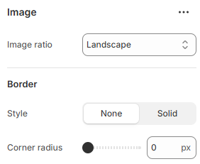

---
metaLinks:
  alternates:
    - >-
      https://app.gitbook.com/s/hbuQuZovtBBsMP54qBxh/sections/blog-post/blog-card/image
---

# Image

<figure><figcaption></figcaption></figure>

|               |                                                                   |
| ------------- | ----------------------------------------------------------------- |
| Image ratio   | Select the image ratio.&#xD; (Adapt, Portrait, Square, Landscape) |
| **Border**    |                                                                   |
| Style         | Changes the style of the solid border.                            |
| Corner radius | Adjust the corner radius width.                                   |
