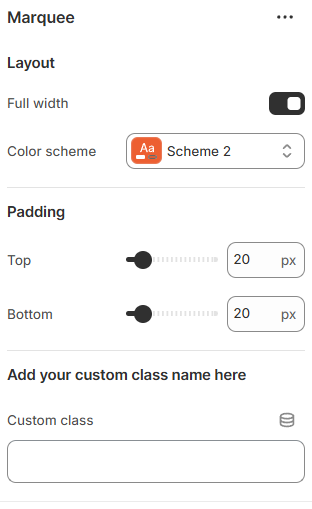

---
metaLinks:
  alternates:
    - https://app.gitbook.com/s/hbuQuZovtBBsMP54qBxh/sections/brand-logo
---

# Brand Logo

The **Brand Logo** section allows you to showcase multiple brand logos across your store in a visually engaging layout. It’s ideal for highlighting partner brands, featured collections, or trusted logos, helping build credibility and strengthen brand presence.

1. Go to **Shopify Admin → Online Store → Themes**.
2. Click **Customize** on your active theme.
3. In the Theme Editor, click **Add Section → Brand Logo**.

<figure><figcaption></figcaption></figure>

|              |                                                                              |
| ------------ | ---------------------------------------------------------------------------- |
| **Layout**   |                                                                              |
| Full width   | 
Enable for full-width view.

(Controls the container width)
      |
| Color scheme | Select any color scheme defined in the theme settings > Colors > Schemes.    |
| Padding      | Adjust the vertical padding of the section to control spacing. (Top, Bottom) |
| Custom class | Adding a unique class name to style with CSS.                                |
