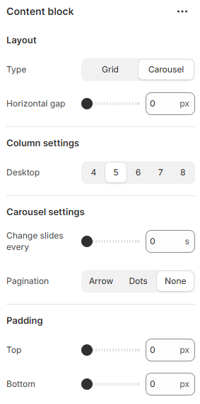

# Content Block

A Content Block is a flexible section used to add and manage custom content such as text, images, icons, or links within a page. It helps structure information clearly and allows easy updates without affecting the overall layout or design.

<figure><figcaption></figcaption></figure>

|                       |                                                                              |
| --------------------- | ---------------------------------------------------------------------------- |
| Type                  | Select the layout type. (Grid, Carousel)                                     |
| Horizontal gap        | Adjust the spacing range between the card.                                   |
| **Column settings**   |                                                                              |
| Desktop               | Select the card column to display on the desktop screen.                     |
| **Carousel settings** |                                                                              |
| Change slides every   | Customize the slide's delay time in seconds.                                 |
| Pagination            | Choose the pagination style. (Arrow, Dots, None)                             |
| Padding               | Adjust the vertical padding of the section to control spacing. (Top, Bottom) |
