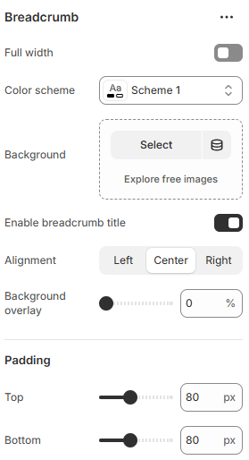

---
metaLinks:
  alternates:
    - https://app.gitbook.com/s/hbuQuZovtBBsMP54qBxh/sections/breadcrumb
---

# Breadcrumb

The **Breadcrumb** helps customers understand where they are in your store and makes navigation easier by showing the page hierarchy. It improves usability and allows visitors to quickly move back to previous pages or categories.

<figure><figcaption></figcaption></figure>

|                         |                                                                              |
| ----------------------- | ---------------------------------------------------------------------------- |
| Full width              | Enable for full-width view. (Controls the container width)                   |
| Color scheme            | Select any color scheme defined in the theme settings > Colors > Schemes.    |
| Background              | Add background image for the section.                                        |
| Enable breadcrumb title | Enable to display title on the section.                                      |
| Alignment               | Align text content. (Left, Center, Right)                                    |
| Background Overlay      | Adjust the percentage of the overlay on the background image.                |
| Padding                 | Adjust the vertical padding of the section to control spacing. (Top, Bottom) |
