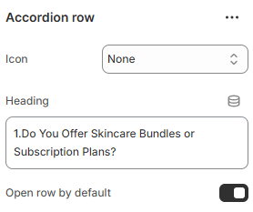

# Accordion Row

Adds an expandable row within the collapsible content section, allowing content to be shown or hidden to organize information clearly and save space.

<figure><figcaption></figcaption></figure>

| Icon                | Choose the icon from the given list.         |
| ------------------- | -------------------------------------------- |
| Heading             | Add the heading content.                     |
| Open row by default | Enable to open the accordian row by default. |
