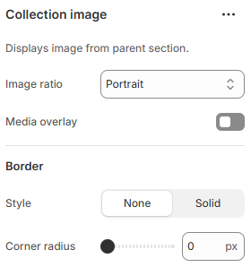

---
metaLinks:
  alternates:
    - >-
      https://app.gitbook.com/s/hbuQuZovtBBsMP54qBxh/sections/collection-list/collection-card/collection-image
---

# Collection image

A Collection Image is used to display a visual representation of a product collection. It helps customers identify and explore collections quickly.

<figure><figcaption></figcaption></figure>

|               |                                                              |
| ------------- | ------------------------------------------------------------ |
| Image ratio   | Select the image ratio. (Adapt, Portrait, Square, Landscape) |
| Media overlay | Enable to apply overlay on the image.                        |
| Overlay color | Pick the overlay color.                                      |
| Overlay style | Select the overlay style. (Solid, gradient)                  |
| **Border**    |                                                              |
| Style         | Select the style of the border.                              |
| Corner radius | Adjust the corner radius width of the border.                |
