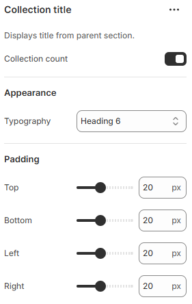

---
metaLinks:
  alternates:
    - >-
      https://app.gitbook.com/s/hbuQuZovtBBsMP54qBxh/sections/collection-list/collection-card/collection-title
---

# Collection title

A Collection Title is used to display the name of a product collection. It helps customers recognize and navigate collections easily.

<figure><figcaption></figcaption></figure>

|                  |                                                                                                                                |
| ---------------- | ------------------------------------------------------------------------------------------------------------------------------ |
| Collection count | Enable to show the count of the product in the collection.                                                                     |
| **Appearance**   |                                                                                                                                |
| Typography       | Select the option from the typography. According to the selected option you will be adjusted to the font family and font size. |
| Padding          | Adjust the padding range around the section. (Top, Bottom, Left, Right)                                                        |
