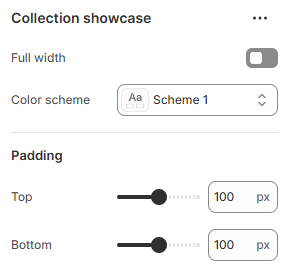

# Collection Showcase

**The Collection Showcase section** highlights specific product collections or curated groups on your store’s homepage or other pages, allowing customers to browse and explore featured categories with ease.

1. In your Shopify admin, go to **Online Store > Themes**.
2. Click **Customize** on your current (live) theme.
3. In the theme editor, click **Add section > Collection Showcase**.

<figure><figcaption></figcaption></figure>

| Expand to full width | Enable for full width view. (Controls the container width)                |
| -------------------- | ------------------------------------------------------------------------- |
| Color scheme         | Select any color scheme defined in the theme settings > Colors > Schemes. |
| Padding Top          | Adjust top spacing for the section.                                       |
| Padding Bottom       | Adjust bottom spacing for the section.                                    |
