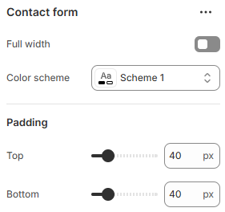

---
metaLinks:
  alternates:
    - https://app.gitbook.com/s/hbuQuZovtBBsMP54qBxh/sections/contact-form
---

# Contact Form

The **Contact Form** section allows customers to easily get in touch with you directly from your store. It’s ideal for handling enquiries, support requests, or general questions, helping you stay connected with your customers and respond efficiently.

<figure><figcaption></figcaption></figure>

|              |                                                                              |
| ------------ | ---------------------------------------------------------------------------- |
| Full width   | Enable for full-width view. (Controls the container width)                   |
| Color scheme | Select any color scheme defined in the theme settings > Colors > Schemes.    |
| Padding      | Adjust the vertical padding of the section to control spacing. (Top, Bottom) |
